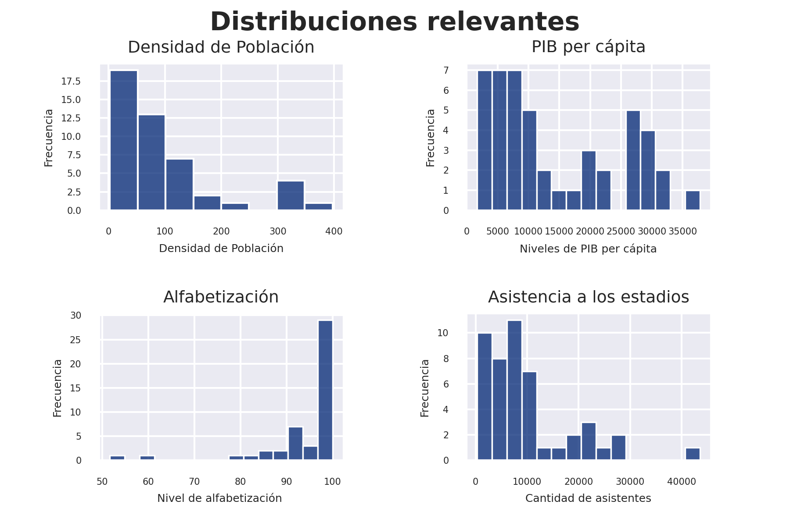
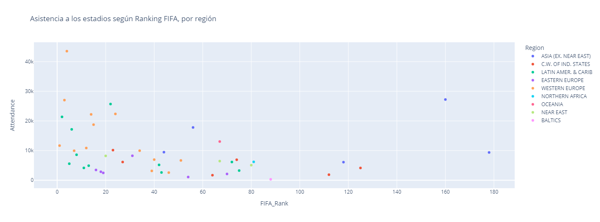

# Predicción de asistencia a los estadios de fútbol
Este trabajo trata de un análisis de un conjunto de datos del año 2016, que contiene información general sobre 88 países. Incluye variables como la población, PIB per cápita, nivel de alfabetización, tasas de natalidad y mortalidad, entre otras. Además, contiene datos de carácter futbolístico, como el ranking FIFA de la selección de cada país, asistencia promedio a los estadios en la liga local y el factor de ventaja de equipos locales en la liga. Este último dato hace referencia a que tan probable es que en un partido de la liga doméstica el equipo local obtenga un triunfo.

El dataset contiene valores nulos en varias de sus columnas, como ‘Climate’, ‘Literacy’, ‘Phones’, ‘Birthrate’, ‘Deathrate’, 'UEFA_Rank' y 'Attendance'. 
Para la columna 'Climate' se rellenaron los valores nulos generando promedios de clima para cada región del país respectivo. Los valores nulos de las columnas ‘Literacy’, ‘Phones’, ‘Birthrate’ y ‘Deathrate’, no pudieron ser completados, por lo que esos registros fueron eliminados. La columna ‘UEFA_Rank’ fue eliminada, ya que no era necesaria para el trabajo.
Se generaron dos dataframe, uno con los registros que poseen un valor válido en ‘Attendance’ y otro para los que tienen un valor nulo en dicha columna.
Finalmente, en el dataframe con valores válidos para 'Attendance' se creo una columna nueva llamada ‘ratio_att’, que nace a partir de la división de ‘Attendance’ por ‘Population’ y que se refiere al ratio entre la asistencia a los estadios en función de la población.

## Visualizaciones

En esta primera visualización se representan las distribuciones de algunas de las variables más importantes de la base de datos.
Respecto a la densidad poblacional, en general los valores se encuentran por debajo de 200 y solo hay algunos outliers en el rango 300-400.
El PIB per cápita del dataset se mueve en un rango bastante amplio, va desde los 5.000 hasta los 350.000 USD. La mayor frecuencia se encuentra en los valores por debajo de 10.000 USD.
Por otro lado, en la alfabetización, vemos que la mayoría de los países, se ubican por sobre 80. Existen algunos valores extremos cercanos a 50 y 60.
En tanto, en lo que respecta a asistencia a los estadios, las mayores frecuencias se encuentran por debajo de los 10.000 asistentes.
.png)
Existe una relación muy leve entre la asistencia a los estadios y el ranking FIFA de cada selección, observable en los países que están por sobre los 15.000 promedio de asistentes, ya que casi todos se ubican dentro de las 30 mejores selecciones del mundo.

Al categorizar por región la visualización anterior, se observa que en general los países de Europa Occidental presentan cierta correlación positiva entre el ranking FIFA y la asistencia a los estadios. Además, se trata en general de selecciones con mucha historia en el fútbol.
Un caso similar se advierte en Latinoamérica, donde los países con selecciones más poderosas presentan mayor asistencia a los estadios en sus respectivas ligas.

.png)
Para complementar la visualización anterior, se analiza la asistencia a los estadios por cada región y se aprecia que Europa Occidental es por lejos la región que más gente lleva a los estadios, seguida por Latinoamérica y el caribe.

.png)
La lista de países con mayor asistencia a los estadios la encabeza por amplio margen Alemania, seguida de India y España.

## Modelos
Para esta etapa se realizaron los modelos KNN Regressor, Decision Tree Regressor y Random Forest Regressor.
Se utilizaron todas las columnas salvo ‘Country’ y ‘Region’, ya que eran las únicas de tipo objeto del dataset.
Se separaron los datos en 70% entrenamiento, 15% testeo y 15% validación, ya que se hará una optimización y se realizó escalamiento para todos los modelos.
Además, para cada modelo se generó la predicción de ratios de asistencia para dataset completo, pudiendo obtener una diferencia entre el ratio real y el predicho.
Se obtuvieron muy buenos resultados para KNN Regressor, pero muy malos para el resto de los modelos.
.png)
En general se observan buenos resultados de predicción para casi todos los países. El modelo solo tiene problemas para predecir correctamente a 15 países, que corresponden a casi el 32% de la muestra. Dentro de ese 32%, sólo 4 países, que corresponden aproximadamente al 8% de la muestra, tienen diferencias de más de 20 puntos base.

## Conclusiones
En general las variables del dataset no logran explicar satisfactoriamente nuestra variable objetivo. Probablemente existan otras variables que afecten la asistencia a los estadios, como por ejemplo el grado de futbolización del país o la competitividad del campeonato.
Queda pendiente la aplicación del modelo más exitoso a la parte del dataset que no tenía datos de asistencia a los estadios, para determinar como se comporta el modelo en condiciones de aprendizaje no supervisado.

